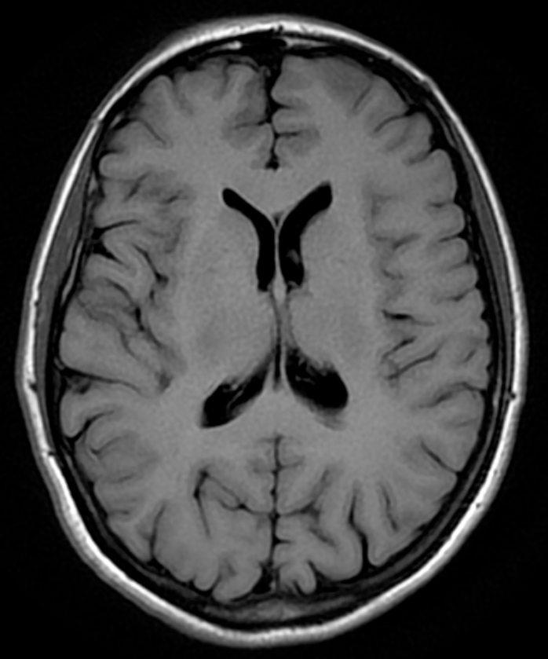
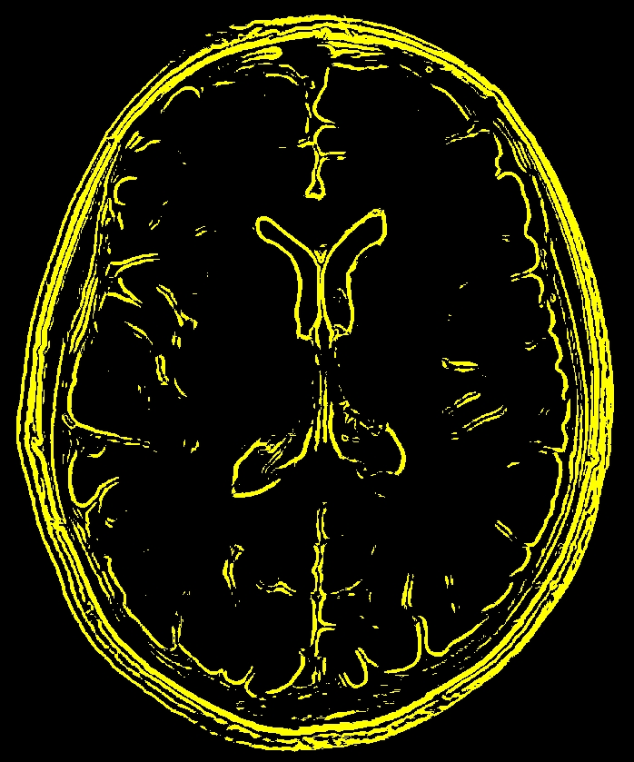
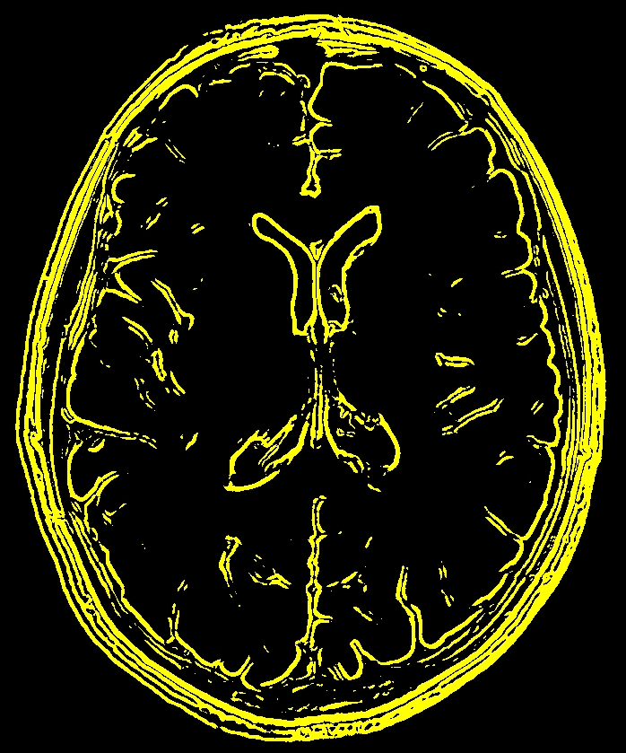

# segmentator
This is a simple library for image segmentation written in Golang.
I need it for my CG synopsis (it is in synopsis folder), but hope it'll be usefull for You too :)

# structure of the library

0) Loading and Saving Images:
   - Load Image: func LoadImage(path, name string) (img Image, err error)
   - Save Image: func SaveImage(path, name string, img Image) (err error)

1) Grayscale algorithms:
   - Averaging ("Quick and Dirty"): func GSAveraging(img Image)
   - Correcting the human eye ("Luma"): func GSLuma(img Image)
   - Desaturation: func GSDesaturation(img Image)
   - Decomposition (Maximal and Minimal): func GSDecomposition(img Image, do int) (err error)
   - Single Color Channel (Red, Green or Blue): func GSDecomposition(img Image, do int) (err error)

2) First generation algorithms:
   - Based on Edge-Detection:
      - Roberts operator: func FGEDRoberts(img Image, do int) (err error)
      - Previtt operator: func FGEDPrevitt(img Image, do int) (err error)
      - Sobel operator:   func FGEDSobel(img Image, do int) (err error)
      - Scharr operator:  func FGEDScharr(img Image, do int) (err error)
      - Custom operator:  func FGEDCustomOperators(img Image, GxOp, GyOp [][]int, do int) (err error)
   - Based on Pixel Classification:
      - Simple Iterative: func FGPCIterative(img Image) (threshold int)
      - Otsu: func FGPCOtsuThresholding2(img Image) (threshold int)
      - Custom: FGPCThreshold(img Image, thresholds []int, colors []Pixel) (err error)
   
3) Helpers:
   - abs: func abs(value int) int
   - min: func min(values ...int) int
   - max: func max(values ...int) int

# important notes

1) Disputes on which coordinate system to use when processing images continues to the day. I prefer Gonsales-Woods varinant:

# examples

